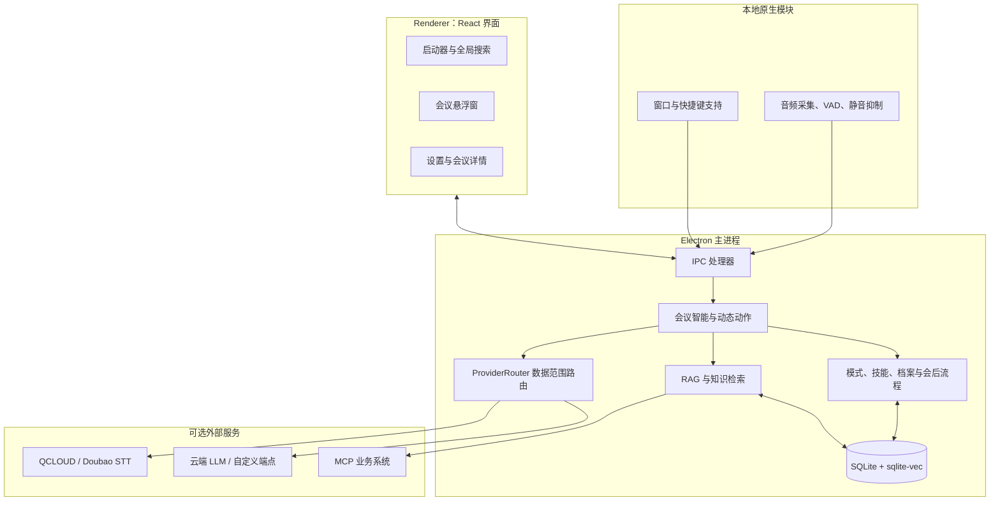
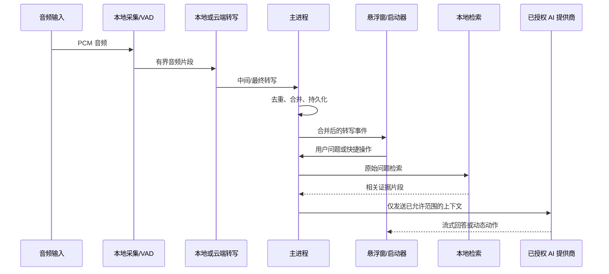
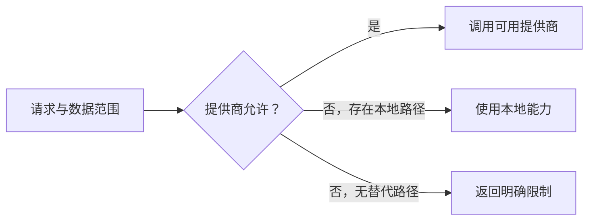

# CueUp 架构与隐私说明

本说明解释 CueUp 为什么采用 Electron 主进程、React 界面、本地原生音频模块和本地 SQLite 的组合，以及会议数据如何在本地能力、云端提供商和知识源之间流动。

## 架构概览

## 一场会议的数据流

## 为什么数据范围是路由条件

CueUp 不把“选择哪个模型”和“能发送哪些数据”混为一谈。请求会声明其携带的范围，例如转录、截图、参考文件、档案历史、Embedding 或会后摘要；`ProviderRouter` 先检查该提供商是否被授权处理这些范围，再选择可用路径或返回明确的拒绝原因。

这避免了把已关闭的参考资料、档案或截图伪装成“普通转录”发送给云端。但它的代价是：关闭范围后，依赖该内容的功能可能不可用或降级。

## 检索与知识边界

本地资料与模式参考文件在本地提取、分块、索引并按查询检索。检索优先保留用户原始问题做词法/精确召回，扩展查询仅用于语义 Embedding；因此短中文术语不会被摘要式扩展稀释。Embedding 不可用时，检索可退回中文 n-gram/关键词路径。

业务系统知识源与本地资料不同：它通过 MCP 服务端动态发现工具及参数 schema，并向服务端发起只读查询。服务端负责认证和安全策略，CueUp 将返回结果作为受控证据，不将其视为可以执行的指令。

## 多窗口与输入安全

CueUp 有启动器、会议悬浮窗、设置、模型选择器和截图裁剪器等窗口。窗口生命周期集中由 `WindowHelper` 管理；隐藏或折叠的覆盖层会调整鼠标事件穿透，避免遮挡桌面其他应用，同时保留必要的快捷键行为。

## 本地保存与日志

- 会议、摘要、索引、模式和设置保存在本地 SQLite；向量检索使用 sqlite-vec。
- 凭据由 Electron `safeStorage` 加密保存，不放在 Renderer 状态或浏览器式本地存储中。
- 日志和质量报告只记录脱敏后的状态、计数与耗时，不应包含原始转录、提示词、截图、证据或凭据。
- 删除档案、资料或模式时，应用会同时清理关联的数据库记录、索引和受控上传副本。

## 设计取舍

| 选择 | 获得什么 | 代价 |
| --- | --- | --- |
| 本地 SenseVoice 优先 | 更低的会议内容外发需求和更低的网络依赖 | 本地模型占用磁盘与计算资源，且不提供通用多人分离 |
| 受控云端提供商路由 | 可按数据类型控制外发边界 | 关闭范围会使依赖该内容的云端功能降级或不可用 |
| 片段检索而非全文注入 | 降低 token 成本和间接提示注入风险 | 未命中的资料不会自动进入回答，需要优化资料与提问 |
| MCP 动态工具发现 | 能适配不同业务系统的服务端 schema | 可用工具、参数和权限由连接的 MCP 服务端决定 |

相关： [功能与设置参考](REFERENCE.md) · [知识源与档案智能](HOWTO_KNOWLEDGE_AND_PROFILE.md) · [会议辅助](HOWTO_MEETING_ASSISTANCE.md)
