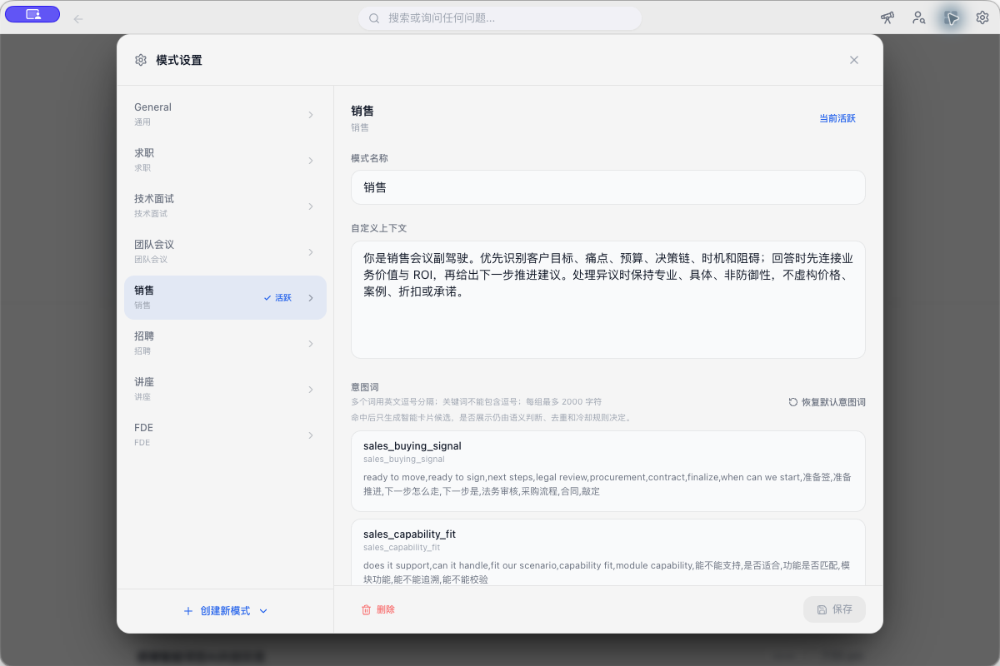
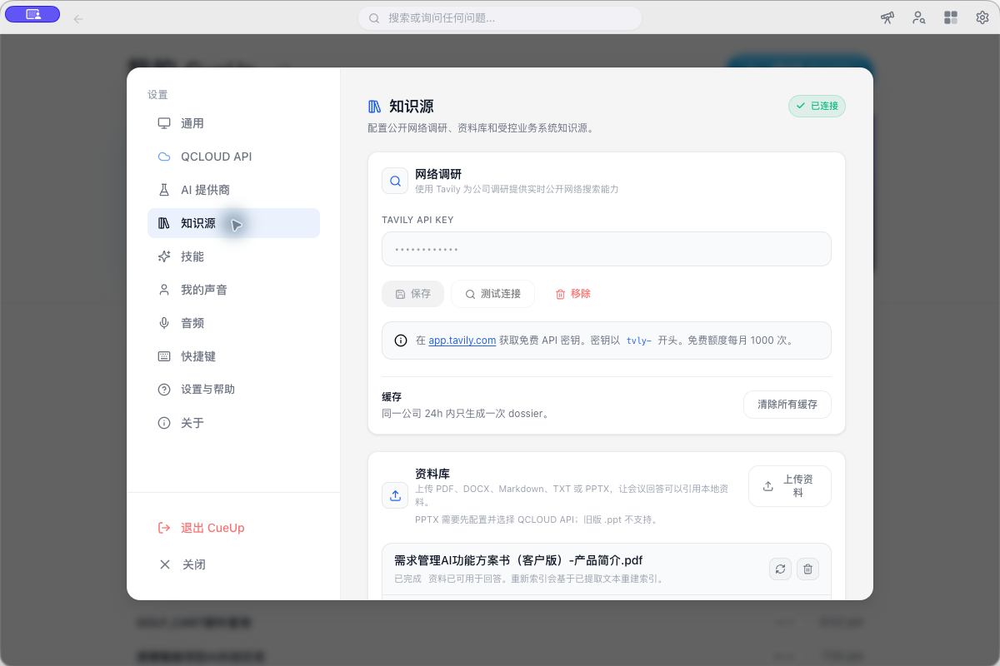

# 客户会进行到关键问题时，怎样把实时辅助用在刀刃上

> 本文依据 CueUp 的公开使用文档、架构说明和本机安装版界面整理。它介绍一套可练习的会中工作方法，并说明产品已公开的能力与边界。文中没有虚构客户项目，也不对转写准确率、响应速度或成交结果作量化承诺。

客户会最紧张的时刻，通常发生在对方把话题从“我们先了解一下”带到一个必须回应的问题上。

“你们和现有系统怎么集成。”

“这个方案到底能不能在我们现场落地。”

“如果我们投入人力，三个月以后能看到什么。”

很多会议在这里开始失速。团队有人翻 PPT 讲功能，另有人去群里找案例。客户的问题没有得到直接回应，团队也没把需要补的事实、需要确认的范围和下一步动作分开。会开完以后，大家往往记得讨论过什么，却说不清哪一句已经构成承诺。

实时辅助有用的地方，是在这些时刻帮人把注意力拉回问题本身。它不替你说话，也不替你承担业务风险。它可以提醒你该问什么、该查什么、该在结束前确认什么。

CueUp 的会中功能正好适合放进这套工作法。它以实时转写为输入，结合当前会议模式、用户问题和允许使用的知识片段，提供手动回答、动态卡片和会后记录。下面只讨论怎样把它用在客户会议现场。

## 三种容易失手的会中场景

### 客户问集成，团队马上开始讲能力

客户问“能不能和我们的 PLM 集成”时，团队需要补足流程、同步对象、读写范围、接口负责人和验收标准这些信息。

这时先把回答放慢一点。可以顺着下面几个问题往下问。

1. 需要打通的流程从哪里开始，到哪里结束。
2. 哪些对象和字段必须同步，哪些数据只读即可。
3. 系统接口、账号和权限资料由谁提供。
4. 客户准备用什么条件判断集成成功。

这几句会把“能不能集成”变成一份可讨论的清单。技术同事随后再解释 API、部署和数据映射，客户更容易判断这些能力是否适合自己的现场。

### 客户要求案例，手边的资料很多却无法核对

客户问“有没有同类行业案例”时，最怕的是为了让现场不冷场，凭记忆给出一个不适用的案例。案例的产品版本、客户条件、实施范围和时间都可能不同。

会中应该先把检索目标说清楚。要找的是同一行业，还是相同的业务流程。客户要的是产品能力证明，还是可量化的实施结果。资料里哪一句能支撑当前表述，哪一句需要回到原文件再确认。

CueUp 可以索引 PDF、DOCX、Markdown、TXT 和 PPTX，并在提问时返回相关片段。Embedding 暂时不可用时，系统会继续用关键词和中文 n-gram 检索。检索命中只代表找到了相关资料，不能代替原始文件的复核。

### 会议快结束，行动项说得很热闹

客户会临近结束时，最容易出现“那我们后面再对一下”的句子。大家都觉得这是一种推进，回去却没人知道谁先动。

这里需要把行动拆成三个可见部分。谁做，交付什么，什么时候再确认。日期暂时定不下来，也要明确由谁在会后发出候选时间。这样写出来的行动项很普通，但足够让下一场会议顺着今天继续往下走。

## 实时辅助怎样进入这些场景

CueUp 的会中处理从实时转写开始。音频输入经过本地采集和语音转写，系统会合并、去重并持久化转写结果，再把合并后的事件发到会议界面。用户可在输入框直接提问，系统会按当前问题检索相关证据，并只将获授权的数据范围交给可用的 AI 服务。

会中使用有两个很实际的前提。

第一，滚动转写要稳定更新。没有可用转写，问答、摘要和动态卡片都缺少判断依据。开始会议后，先看这件事，比急着测试 AI 回答更重要。

第二，当前模式要贴近会议角色。销售、FDE、团队会议和招聘关注的信号不同。模式会影响实时提示、动态动作和会后笔记的组织方向。

*图 1 展示本机安装版的销售模式配置页。这里可以维护上下文、意图词和会后笔记分区。*

不同场景的实时辅助，关注点应当跟着会议角色走。

| 场景 | 会中优先关注什么 | 适合马上发起的提问 |
| --- | --- | --- |
| 销售 | 客户需求、异议、产品反馈和下一步 | “给我一个澄清问题” |
| FDE | 工作流、接口边界、技术约束、风险和验收条件 | “还需要确认哪些集成条件” |
| 招聘 | 候选人的经历、技能、回答质量和岗位期望 | “基于刚才的回答继续追问什么” |
| 团队会议 | 进展、阻塞项、决策、负责人和截止时间 | “整理已确认的负责人和下一步” |
| 技术面试 | 解题思路、边界条件、代码提示和问题覆盖 | “这个方案还缺哪些边界情况” |

销售和 FDE 最能体现客户会议里的实时辅助价值，文章前面也以这两个场景展开。招聘、团队会议和技术面试使用同样的转写、提问和卡片入口，只是关注点换成了各自需要判断的内容。模式不会替人核对价格、法规、交付范围或客户承诺，重要信息仍要回到会议原文和原始资料。

会中有两种使用方法。

一种是主动提问。遇到客户的集成顾虑，可以输入“给我一个澄清问题”。讨论结束时，可以输入“整理刚才确认的负责人和下一步”。提问越具体，得到的建议越容易核对。

另一种是查看动态卡片。CueUp 只有在当前模式、实时会议信号和可用证据同时满足条件时，才会显示卡片。卡片可能是一句回应建议、一份检查清单、一封跟进草稿、一条行动项或决策记录。它不是每句话都会出现，同一时刻最多显示三张，高置信度卡片可能出现约五秒倒计时。用户可以接受、忽略或修改。

我更建议把动态卡片当作提醒和草稿。卡片出现时，先问一句，它引用了什么事实，是否适合当前客户，是否包含对外承诺。确认之后再用，比直接照读更稳妥。

## 让工具带着证据出现

实时辅助很容易变成一个只会给漂亮句子的窗口。客户会议里，漂亮句子常常不够用。客户会继续追问来源、条件、责任和例外。

CueUp 的资料库与业务系统知识源为这一步提供了入口。资料库可保存本地文件并检索相关片段。业务系统知识源则通过 MCP 发现服务端的只读工具和参数 schema，再把查询结果作为受控证据参与回答。

*图 2 展示知识源页面。本机截图中的 API Key 由应用界面掩码显示，未包含原始密钥。*

以 Windchill 或 QMS 一类系统为例，会中查询可以帮助团队核对状态、资料边界或已有记录。CueUp 不会通过知识源创建、更新、审批或提交业务操作。写入和审批仍在原系统中由人完成。

这个边界很重要。实时辅助应当缩短查找和整理的时间，让人有更多注意力处理客户问题。它不能越过授权、替代审批，或把一段模型生成的文字变成事实。

## 一场客户会里的使用顺序

开始会议后，先看转写是否持续更新。确认模式无误，再打开本次需要的资料和业务系统知识源。

客户提出关键问题时，先用一句话复述问题，确认双方讨论的是同一件事。随后补问流程、条件和验收标准。需要依据时再检索资料，不要让全部文件一次进入上下文。

系统给出回答或动态卡片后，核对其中的事实和适用范围。可以直接采用不涉及承诺的澄清问题或检查清单。涉及价格、排期、性能、合规和交付的内容，应该回到原始资料和负责人的确认。

会议结束前，把行动项逐条读一遍。CueUp 会后记录可以汇总会议概述、关键要点、决策、行动项和待确认事项，后续还可进行全文搜索或导出可编辑 DOCX。记录的目标是让下一场会接住今天的上下文。

## 实时辅助能减少哪些机械操作

客户会里最需要的判断仍然来自销售、解决方案和交付人员对客户业务的理解。

它能省下一些更机械的耗费。找资料时反复切窗口，讨论时漏掉已说过的条件，结束时忘了追问负责人和日期，这些事情会消耗会议注意力，也会让对话显得不够可靠。

把实时转写、模式提示、检索证据和行动记录放在同一处，CueUp 可以让这些动作更容易发生。先从一场低风险会议练起，选一个模式，准备少量已经核对过的资料，只观察一个关键问题能否问得更清楚。这样的试用比一次塞进所有资料和功能更容易得到真实判断。

## 参考资料

- [CueUp 会议辅助指南](https://github.com/tang9-c/natively-cluely-ai-assistant/blob/ci/intel-mac-workflow/docs/HOWTO_MEETING_ASSISTANCE.md)
- [CueUp 快速入门](https://github.com/tang9-c/natively-cluely-ai-assistant/blob/ci/intel-mac-workflow/docs/QUICKSTART.md)
- [CueUp 架构与隐私说明](https://github.com/tang9-c/natively-cluely-ai-assistant/blob/ci/intel-mac-workflow/docs/ARCHITECTURE.md)
