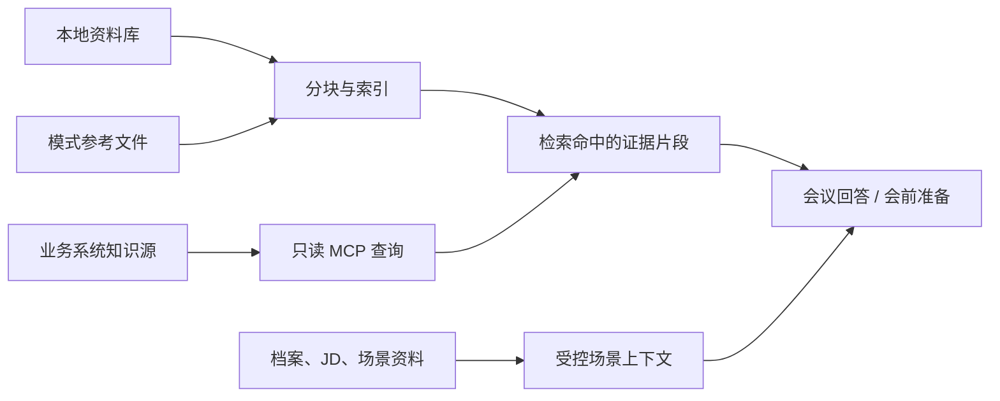

# 如何使用知识源与档案智能

本指南说明如何让 CueUp 在会议中引用本地资料、受控业务系统和个人/场景档案，同时保持资料来源与数据范围可控。

## 知识使用路径

## 1. 上传并维护本地资料库

在“设置 → 知识源 → 资料库”选择“上传资料”。支持 PDF、DOCX、Markdown、TXT 和 PPTX；PPTX 需要已经配置并选择 QCLOUD API，旧版 `.ppt` 不支持。

上传后的状态决定可用性：

| 状态 | 含义与下一步 |
| --- | --- |
| 加入索引队列 / 索引中 | 文本正在提取、分块或建立索引，等待完成。 |
| 已完成 | 可以被后续会议问答、会前准备和检索使用。 |
| 索引失败 | 根据界面错误重新上传、重新索引或更换文件。 |
| 语义检索暂不可用 | CueUp 会用关键词匹配继续检索；不是上传失败。 |

适合上传产品资料、项目方案、案例、标准、规范和已批准的内部材料。重新索引基于已提取文本重建索引；重新上传则替换文件内容。两者都不会回填已经生成的历史会议回答。

## 2. 连接业务系统知识源

在“设置 → 知识源 → 业务系统知识源”新增来源，填写名称、地址和认证方式，再执行连接测试。当前知识源可覆盖 Windchill（PLM）、QMS 与其他受控业务系统。

- 可使用 API Key 或账号密码认证；保存后界面不会回显凭据原文。
- CueUp 通过 MCP 发现服务端可用的只读工具与 schema，再按查询需要调用。
- 查询结果作为可追溯的证据片段参与回答，不等同于对原系统的写入操作。
- 创建、更新、审批和业务承诺必须在原系统中由人确认，CueUp 不会代为执行。

连接失败时依次检查地址、服务端可达性、认证信息和服务端授予的权限。不要把测试用凭据写入资料内容、技能或会议转录。

## 3. 使用模式参考文件

每个模式可以维护其专属的参考文件和自定义上下文。例如销售模式放产品资料和案例，招聘模式放 JD，求职模式放简历和岗位信息。

保持资料最小化：只放当前场景真正要用的内容。CueUp 对这些资料走受控上下文与检索路径，而不是把无关文件的完整副本重复塞进每次回答。

## 4. 使用档案智能与公司调研

档案智能用于维护个人档案、简历、JD、场景资料与相关的公司调研结果：

1. 进入对应档案场景，上传简历、JD 或场景资料。
2. 确认系统抽取的信息，例如经历、项目、教育、技能和岗位要求；必要时手动修正。
3. 需要公司背景时，从档案页启动调研。调研报告只在可用的外部来源和 AI 服务条件满足时生成。
4. 选择档案和场景后再开始会议，使当前场景可以在允许的数据范围内辅助回答。

档案上传的原文属于独立数据范围。关闭“参考文件”或“档案历史”云端范围后，CueUp 不会将相应内容发送给该云端提供商；如果没有可用本地路径，功能会明确提示无法处理，而不会伪装成已完成。

## 5. 验证引用是否可信

检索命中代表“存在相关片段”，不代表其中结论已经经过业务批准。对价格、交付、法规、质量或客户承诺，应：

1. 打开原始文件或业务系统记录核对。
2. 检查片段是否适用于当前产品版本、客户和时间点。
3. 只将经过确认的内容用于对外表达。

相关： [会议辅助](HOWTO_MEETING_ASSISTANCE.md) · [功能与设置参考](REFERENCE.md) · [架构与隐私说明](ARCHITECTURE.md)
