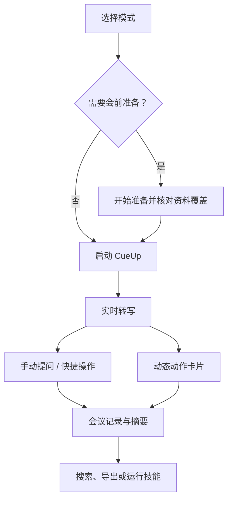

# 如何使用 CueUp 会议辅助

本指南说明如何从会前准备开始，使用模式、实时转写、AI 问答、动态卡片、技能和会后记录完成一次会议工作流。

## 前提条件

- 已授予麦克风权限，并确认音频输入设备正常。
- 已准备本地 SenseVoice，或已配置 QCLOUD API / Doubao AUC 语音服务。
- 需要屏幕辅助时，macOS 已允许屏幕录制与辅助功能；Windows 按系统提示允许相应权限。
- 需要云端 AI 回答时，已配置可用的 AI 提供商并确认数据范围授权。

## 会议工作流

## 1. 选择正确的模式

在启动器或模式管理器中选择模式，再将其设为活跃。模式会改变实时提示、动态动作和会后笔记的组织重点：

| 模式 | 适合什么场景 | 会后重点 |
| --- | --- | --- |
| 通用 | 普通会议与对话 | 摘要、要点、行动项 |
| 销售 | 演示、谈判、客户拜访 | 需求、异议、结果、跟进 |
| FDE | 现场调研、方案与交付推进 | 工作流、技术约束、风险、下一步 |
| 招聘 | 作为面试官评估候选人 | 技能、回答质量、岗位期望 |
| 团队会议 | 周会、项目例会、经营会 | 进展、阻塞、决策、负责人 |
| 求职 | 作为候选人参加面试 | 回答、岗位细节、改进点 |
| 技术面试 | 算法、代码、系统设计 | 分步推理、边界和代码提示 |
| 讲座 | 培训、课程、内部分享 | 概念、详细笔记、作业 |

模式是辅助上下文，不会替代事实核验。涉及价格、合规、交付范围或对外承诺时，请核对原始资料和会议原文。

## 2. 在会前使用“开始准备”

1. 在启动器点击“开始准备”。每次都会新建一份准备，不会自动打开历史草稿。
2. 输入或说出主题、客户、参会人、目标、议程和背景；语音识别后仍可以编辑。
3. 核对 AI 拆解出的字段和推荐模式。需要回顾既有承诺时，可关联一场历史会议。
4. 查看“对方可能问的问题”及资料状态：资料充分、部分准备、资料缺失、无需内部资料或检查失败。
5. 对资料不足的问题点击“补充资料”，完成索引后返回并选择“重新检查”。
6. 点击“使用推荐模式开始会议”后，只会应用你确认的模式，不会自动把准备结果注入会议回答。

会前准备不是 CRM 或日历同步工具，也不会自动验证报价、能力、合规或交付承诺。

## 3. 开始转写并检查输入

点击“启动 CueUp”或使用你在“设置 → 快捷键”配置的启动快捷键。开始后先观察滚动转写是否持续更新。

- 没有转写：检查麦克风权限、输入设备与语音模型是否就绪。
- 需要多人分离：选择已配置的 QCLOUD API 或 Doubao AUC；本地 SenseVoice 不提供通用多人说话人分离。
- “我的声音”只帮助判断哪些发言更可能来自你本人，不等同于多人分离。

## 4. 在会议中手动提问

在启动器或辅助界面的输入框描述你需要的帮助，例如：

- “给我一个澄清问题。”
- “总结刚才确认的决策和负责人。”
- “如何回应客户对集成工作量的顾虑？”
- “基于当前屏幕，给出下一步代码提示。”

CueUp 会根据当前问题、最近转写、活跃模式和命中的知识片段组织回答。问题越明确，回答越容易核对。需要依据屏幕内容时，使用截图提问或代码提示；没有屏幕录制授权，或数据范围禁止发送截图时，云端模型不会收到屏幕内容。

## 5. 理解并处理动态动作卡片

CueUp 只在当前模式、实时会议信号和可用证据满足条件时显示动态卡片。它可能是可说出口的回复、检查清单、邮件草稿、行动项或决策记录。

- 卡片并非每句话都会出现，也不是聊天窗口的替代品。
- 高置信度卡片可能出现约 5 秒倒计时；按 `Tab` 可立即接受当前主卡片。
- 同一时刻最多展示 3 张卡片，较高优先级的新卡片可能替换旧卡片。
- 接受、忽略或关闭前，应确认文本与实际会议一致。

## 6. 会后处理会议

会议结束后，在“我的 CueUp”打开记录。你可以：

1. 查看详细摘要、关键要点、决策、行动项、待确认事项和模式分区内容。
2. 在当前会议中提问，或通过顶部全局搜索查找其他会议的正文命中。
3. 在“转录”中选择技能，将完整转录处理为客户复盘、行动项清单、面试评估或更自然的文本。技能结果会生成 Markdown 文件。
4. 导出可编辑 DOCX。导出以详细摘要为主，需要时附带完整转录。

## 验证与排障

| 现象 | 先检查什么 |
| --- | --- |
| 转写没有更新 | 麦克风权限、输入设备、语音模型下载/连接状态 |
| AI 回答报错 | AI 服务连接、账号状态、数据范围和错误类别提示 |
| 没有动态卡片 | 是否有正常转写、模式是否正确、会话是否出现可触发信号 |
| 屏幕相关回答不可用 | 屏幕录制权限、截图数据范围、当前视觉能力配置 |
| 会前资料状态异常 | 资料是否完成索引；“检查失败”只表示技术检查未完成 |

相关： [快速入门](QUICKSTART.md) · [知识源与档案智能](HOWTO_KNOWLEDGE_AND_PROFILE.md) · [功能与设置参考](REFERENCE.md)
