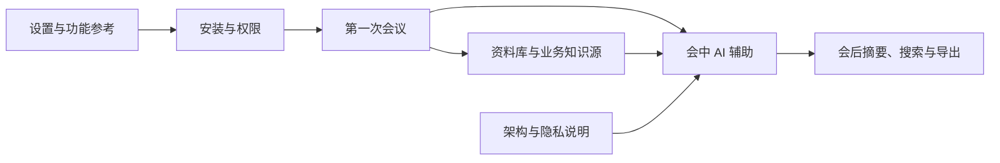

# CueUp 文档目录

CueUp 是本地优先的桌面会议助手：它将音频转写、会议上下文、知识检索和 AI 辅助组合在一起，但每项能力都有独立的权限、模型或服务前提。本目录按读者正在解决的问题组织文档。

## 从这里开始

| 你想做什么 | 阅读文档 | 文档类型 |
| --- | --- | --- |
| 安装后完成第一场会议 | [快速入门](QUICKSTART.md) | 教程 |
| 选择模式、会前准备、会中提问、使用卡片或会后处理 | [如何使用会议辅助](HOWTO_MEETING_ASSISTANCE.md) | 操作指南 |
| 上传资料、连接业务系统、维护个人档案或公司调研 | [如何使用知识源与档案智能](HOWTO_KNOWLEDGE_AND_PROFILE.md) | 操作指南 |
| 查找当前功能、设置项、模型、权限和限制 | [功能与设置参考](REFERENCE.md) | 参考 |
| 理解多窗口、转写、检索、隐私范围和数据保存方式 | [架构与隐私说明](ARCHITECTURE.md) | 原理说明 |

## 文档边界

- 本文档描述当前桌面版已实现的用户功能，不承诺第三方 AI、语音服务或业务系统一定可用。
- 需要云端服务的能力会受到账号、网络、余额、限流和数据范围授权影响。
- “建议”“摘要”“卡片”和“检索命中”都应由用户结合原始会议与资料判断；CueUp 不会替你做写入、审批或业务承诺。

## 图示说明

文档中的 Mermaid 图是与代码一起保存的可版本管理流程图。它们用于说明数据流和功能关系，不替代实际界面；界面名称可能随版本迭代而调整。
