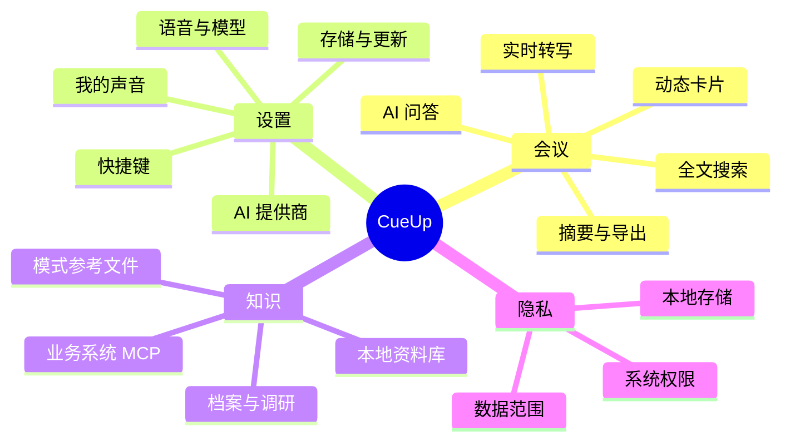

# CueUp 功能与设置参考

本参考面向需要确认“某项功能是否存在、在哪里设置、依赖什么条件”的使用者。实际可用能力还受平台、权限、已配置提供商和数据范围影响。

## 功能地图

## 会议功能

| 功能 | 作用 | 主要前提 |
| --- | --- | --- |
| 实时转写 | 捕获麦克风/系统音频并显示合并后的转写 | 麦克风、音频设备和 STT 可用 |
| 本地 SenseVoice | 默认推荐的本地中文实时转写 | 本地模型已下载并初始化 |
| QCLOUD API / Doubao AUC | 云端转写；可提供说话人信息 | 服务已配置、网络和账号可用 |
| AI 问答与回答建议 | 基于问题、近期转写、模式和证据生成建议 | LLM 可用，所需数据范围允许 |
| 截图提问/代码提示 | 用当前屏幕内容辅助回答 | 系统屏幕权限和截图范围允许 |
| 动态动作卡片 | 依据会议信号主动提供回答、清单、行动或决策 | 正常转写、合适模式及触发条件 |
| 会议搜索 | 当前会议和全部会议的全文/语义检索 | 本地会议记录；语义能力不可用时可退回词法检索 |
| 会后摘要与 DOCX 导出 | 生成详细摘要、行动项、跟进草稿并导出可编辑文档 | 会议已保存；AI 能力按配置可用 |
| 转录技能 | 用内置或自定义 `SKILL.md` 将转录生成 Markdown 成果 | 已有可用技能和 LLM 能力 |

## 设置面板

| 设置区域 | 可配置内容 |
| --- | --- |
| 通用 | 主题、启动与界面相关偏好、存储空间管理等通用选项。 |
| QCLOUD API | 连接地址和凭据测试；可作为聊天、PPTX 解析或语音服务所需能力。 |
| AI 提供商 | 默认聊天模型、QCLOUD API 或自定义端点，以及云端数据范围。 |
| 知识源 | 公开调研入口、本地资料库和受控业务系统知识源。 |
| 技能 | 查看、刷新和管理内置/自定义技能。 |
| 我的声音 | 录制本人声音特征，作为发言归属纠错的辅助能力。 |
| 音频 | 输入设备测试、语音提供商和本地模型状态。 |
| 快捷键 | 调整启动、问答、澄清、截图、窗口移动和滚动等快捷操作。 |
| 设置与帮助 | 查看平台权限、功能边界与故障排查说明。 |
| 关于 | 版本信息、质量报告和在线更新状态。 |

## 语音、说话人与“我的声音”

| 项目 | 本地 SenseVoice | QCLOUD API / Doubao AUC | 我的声音 |
| --- | --- | --- | --- |
| 主要用途 | 本地实时转写 | 云端转写 | 识别“更可能是我”的发言 |
| 通用多人分离 | 不提供 | 支持，取决于服务端响应 | 不提供 |
| 数据位置 | 本机 | 发送到已授权云端服务 | 本地声纹资料 |
| 适用场景 | 隐私优先的日常会议 | 需要云端能力或多人信息 | 修正本人/非本人归属 |

## 权限与数据范围

### 系统权限

- **麦克风**：所有实时转写的必要条件。
- **屏幕录制**：仅在截图、屏幕理解或代码提示等屏幕能力需要时使用。
- **辅助功能（macOS）**：支持全局快捷键和相关交互。

### 云端数据范围

可按提供商控制转录、截图、参考文件、档案历史、Embedding 和会后摘要是否能发送到云端。范围被关闭时，该提供商不会收到对应内容；没有替代本地路径时，功能会报明原因而非静默绕过设置。

## 资料与业务系统限制

- 资料库支持 PDF、DOCX、Markdown、TXT、PPTX；`.ppt` 不支持。
- PPTX 需要配置并选择 QCLOUD API。
- 资料只有索引完成后才适合语义引用；Embedding 不可用时可使用关键词匹配。
- 业务系统知识源仅做只读查询。MCP 服务端自行定义可发现工具和参数 schema；CueUp 不执行写入、审批或承诺。

## 平台、存储与更新

- 支持 macOS（Apple Silicon 与 Intel）和 Windows 10/11；Linux 支持有限。
- 会议、设置与本地索引保存于应用用户数据目录的 SQLite 数据库；凭据通过 Electron `safeStorage` 保护。
- “关于”页可手动检查在线更新。未签名 macOS/Windows 安装包可能触发系统安全提示，请仅从项目 Releases 获取并按发布说明处理。

相关： [快速入门](QUICKSTART.md) · [会议辅助](HOWTO_MEETING_ASSISTANCE.md) · [知识源与档案智能](HOWTO_KNOWLEDGE_AND_PROFILE.md)
