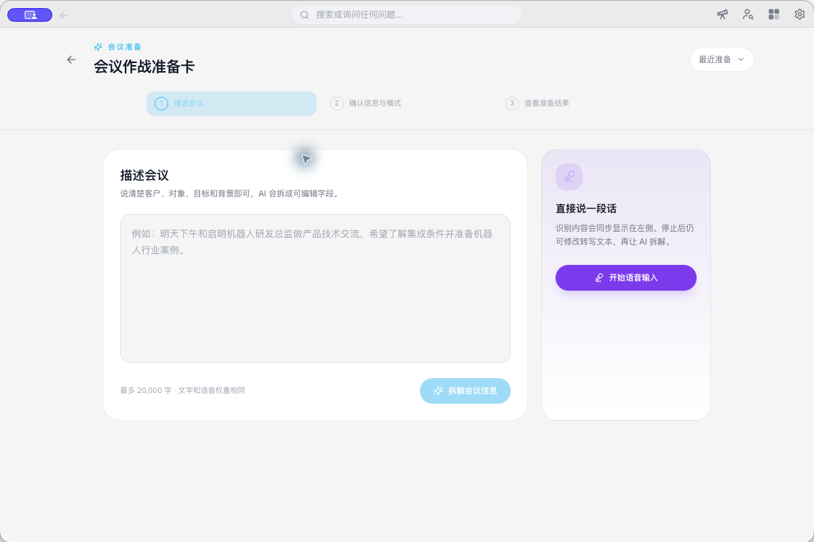

# 面试官如何用实时 AI 辅助，把每一次追问落到证据上

一场技术面试进行到二十分钟，候选人说了一句很常见的话。

“我之前负责过一个后端项目，主要做了系统重构。”

这句话听起来有内容，真正能用于判断的信息却还不够。候选人负责了哪一部分，为什么要重构，方案由谁决定，结果怎样衡量，回答里都没有交代。面试官要继续听，还要翻看简历和职位要求，脑子里同时留着几个待追问的问题。等候选人说完，最关键的那个问题很可能已经漏掉了。

CueUp 当前的招聘模式，适合处理的正是这类现场负担。它记录对话，根据职位资料整理候选人已经说清楚的内容，在合适的时候提示政策问题和岗位兴趣。它不会替面试官给出录用结论，也不会根据口音、语速和停顿评价能力。这样的边界看上去克制，却更接近一件能在真实招聘中使用的工具。

## 一　场景痛点

### 面试官同时做着几份工作

面试官在会中需要完成两类动作。一类是交流，听懂回答，控制节奏，让候选人有机会把经历讲完整。另一类是取证，把回答与 JD、简历和评分标准对照，判断哪些要求已有事实支撑，哪些仍需核实。

这两类动作很容易互相打架。低头记笔记会错过候选人后半句，专心交流又可能在会后只剩下模糊印象。候选人说“我们完成了系统重构”，面试官当时觉得回答不错，回看记录时才发现，个人职责、技术取舍和可衡量结果都没有问出来。

招聘中的实时辅助，应当先减少这种遗漏。它要保存原话，提示信息缺口，把问题送回现场。至于候选人是否胜任，仍由面试官依据统一标准和完整证据决定。

### 政策问题往往来得突然

候选人可能在面试后半段询问签证、薪资范围、远程办公、搬迁支持和入职时间。面试官未必掌握每项政策，临场给出一个听起来合理的答案，后续很容易与招聘团队的正式口径冲突。

这类问题适合由系统识别，却不适合让模型自由发挥。CueUp 的现有策略要求政策类回应依赖可信参考资料。资料没有提供答案时，界面应提示由招聘方确认，不拿通用知识补出公司政策。

### 实时提示也可能制造偏见

招聘产品最危险的功能，常常是一个看起来很省事的分数。系统一旦显示“强匹配”或“建议录用”，面试官很难完全忽略它。模型可能只是看见候选人表达流畅，或多次使用职位描述里的词，就把语言风格误当成岗位能力。

CueUp 当前已经暂停自动生成候选人经历评价，也删除了 Strong Yes、Lean Yes、Lean No、Strong No 这类录用建议。界面中的岗位兴趣提示只表示候选人明确表达了兴趣，不代表候选人与岗位高度匹配。

## 二　工具怎样介入

### 会前把招聘资料放进同一个上下文

面试开始前，可以在会议准备页描述会议，再选择 Recruiting 模式。系统会把这场会议按招聘场景处理，后续提示围绕岗位要求、候选人回答和招聘政策展开。

当前模式设置页列出了招聘模式，也允许招聘者填写自定义上下文。这里适合放团队背景和岗位要求，主观评价不宜写成候选人事实。

JD、评分卡、候选人简历和正式招聘政策可以作为参考文件加入资料库。系统使用 JD 和评分卡确认岗位证据，用简历交叉核对候选人陈述，用政策文件回答薪资、签证和办公方式等问题。

这一步决定了会中提示能否落到具体事实。资料库里没有 Kubernetes，系统就应写明该技能尚未得到资料支持，再建议面试官追问。它不该从外部常识里补一段 Kubernetes 经验，安到候选人身上。

### 会中只处理候选人的声音

生产环境里，远端系统音频标记为 `interviewer`，实际对应候选人。本机麦克风标记为 `user`，实际对应招聘者。招聘动态动作只处理远端候选人的发言，本机招聘者说出相同的话不会生成候选人卡片。

这个细节很重要。面试官问“你对薪资有什么期望”，系统不应据此判断候选人提出了薪资顾虑。只有候选人真正谈到薪资、签证、远程办公、搬迁、职级、Offer 或入职时间，政策卡片才进入后续判断。

卡片出现在会议浮窗的动态动作区域。界面会显示“建议动作”、触发原因和预期输出。面试官可以点击“生成回应”，也可以按 Tab 处理最优先的卡片；无关提示可以直接“忽略”。当说话人身份不确定时，界面会显示“说话人待确认”，让用户选择“确认”或纠正归属。

当前招聘模式有两类自动候选动作。

候选人提出招聘政策或相关顾虑时，界面显示“回应招聘政策或顾虑”。系统根据可信政策材料生成一段可说出口的回应，证据不足就明确交给招聘方确认。

候选人明确表达岗位兴趣时，界面显示“回应候选人的岗位兴趣”。它生成一段简短回应，卡片保持普通状态，不会在五秒后自动执行，也不会把兴趣解释成能力匹配。

一段具体对话可以看出这种设计的用途。

候选人说“我希望了解团队规模和晋升机制”。系统可以把它识别为招聘政策问题。若资料中有正式说明，面试官可以生成回应；资料不足，界面提醒后续由招聘团队确认。

候选人说“我之前负责过一个后端项目，主要做了系统重构”。系统目前不会据此自动评价候选人的经历。面试官可以主动询问助手，这段回答还缺哪些岗位证据。招聘提示会整理已观察证据、缺失证据和待验证事项，并给出一个中性问题，例如请候选人说明自己做出的具体决定和重构后的可衡量结果。

这一区分保留了面试官的控制权。高频、边界清楚的政策问题可以由卡片提示。涉及能力判断的内容由面试官主动发起，系统只整理证据和建议追问。

### 会后把信息整理成可复核的记录

会议结束后，招聘模式会按行动项、经验与技能、回答质量、对公司的兴趣和岗位期望整理记录。会议详情页还保留原始转录，面试官可以回到候选人的原话核对摘要。

其中“回答质量”需要谨慎使用。合理的写法应当描述回答是否具体，是否提供个人职责、过程和结果，哪些说法仍需确认。它不能变成对性格、口音或表达习惯的评分。

系统还会检查招聘流程信息是否遗漏。整场面试没有谈到薪资、时间和可入职日期时，会后记录可以提醒招聘者补充确认。候选人表达过岗位兴趣，或面试中接受过政策回应，这些内容也会作为内部记录保存，供招聘者复核。

## 三　价值升华

实时辅助对面试官最直接的价值，是让注意力重新回到谈话。面试官少记一部分机械笔记，多听候选人的完整回答；系统负责保存转录，指出资料和回答之间尚未闭合的地方。

第二个价值来自一致性。同一个岗位连续面试多名候选人时，面试官可以围绕相同的 JD 和评分卡追问，记录候选人明确提供的证据。系统不该因为某位候选人更健谈，就把表达优势写成能力优势。统一资料、保留原话和中性追问，能让后续复核更有依据。

它也降低了临场承诺的风险。候选人询问公司政策时，系统优先查可信材料。没有依据就留下待确认项。这比给出一句顺耳却错误的答复可靠得多。

现阶段，CueUp 最合适的位置是一名克制的面试副驾驶。它能听、能记，也能在政策问题和证据缺口出现时提醒面试官。录用标准怎样设，候选人的证据是否充分，最终决定仍由人承担。

好的招聘辅助不会让面试官更快地下结论。它让面试官在下结论以前，少漏掉一句关键回答，多问出一个有用的问题。
